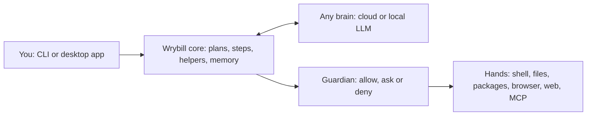

# Wrybill

**A secure, lightweight, open-source, adaptive, self-improving, LLM-agnostic AI agent.**

> **Early days.** Wrybill is being designed and built in the open, and there's nothing to install yet. The design is in [docs/SPEC.md](docs/SPEC.md). The first milestone (M0) has laid the foundations: the `wrybill` command builds for macOS, Windows and Linux, and `wrybill doctor` reports on the computer it runs on. The agent itself starts with M1.

Wrybill is being built as a secure, lightweight, open-source AI agent that learns and improves, with the ability to create and coordinate multiple agents to get work done. Tell it what you need, and it will work out what your computer has, set up what's missing, run and test things, use the browser and the web, and learn from each job so the next one goes better. It's designed to work with whichever LLM you give it, from a local LLM to Claude, ChatGPT or Gemini, and to ask before doing anything risky.

## Why the name "Wrybill"?

The wrybill, or ngutu pare, is a small New Zealand plover, and the only bird in the world whose beak bends sideways, always to the right. That bend is thought to help it reach food under the stones of the braided rivers where it breeds. A bird shaped by exactly where it lives felt like the right name for an agent built to fit your computer, your habits and whichever brain you plug in.

Only about 5,000 wrybills remain. If the name makes you smile, have a read about them on the [Department of Conservation's wrybill page](https://www.doc.govt.nz/nature/native-animals/birds/birds-a-z/wrybill/) and [NZ Birds Online](https://www.nzbirdsonline.org.nz/species/wrybill).

## What we're building

- **Any brain.** The LLM is a setting, not a dependency. You'll be able to use a local model through Ollama, LM Studio or llama.cpp, or a cloud model such as Claude, ChatGPT or Gemini with your own API keys. Take every cloud model out and Wrybill will still work, within what your local model can do.
- **Learns on the job.** Wrybill will keep lessons, preferences and reusable skills from real tasks, so it gets quicker and makes fewer mistakes over time. Everything it learns will be plain Markdown you can read, edit or delete, and it will not rewrite its own code.
- **Careful by design.** A Guardian will check every action before it runs: reading is fine, risky things wait for your yes, and some things are never allowed. Commands will run in an OS sandbox where one's available, every action will go into a tamper-evident audit log, and you'll be able to undo file changes.
- **Light enough for old laptops.** Small Rust binaries (a CLI and a desktop app sharing one core), with no Python, JVM or Node.js runtime to install. The goal is any 64-bit laptop from 2015 onwards: macOS 11 or newer (including 2015 Intel MacBooks), Windows 10 and 11, and Linux.
- **Brings in helpers when it's worth it.** Big jobs that split into independent pieces will be able to go to helper agents, which share one budget and one set of safety rules.
- **Private when you need it.** No telemetry, ever. Private mode will use only local models (or ones on your home network that you've marked as trusted) and ask before going online, and Wrybill will never quietly move work from a local model to the cloud.
- **Open formats.** Skills will use the Agent Skills format (`SKILL.md`), tools will plug in through MCP, and coding agents already follow `AGENTS.md` here, so what you've built for other tools will work with Wrybill too.

## How it fits together

In Wrybill's design, the brain only ever proposes an action. The Guardian decides whether it runs, and only you can widen what it allows.

## Roadmap

| Milestone | What it brings |
|---|---|
| **M0 Foundations** | The Rust workspace, CI for macOS, Windows and Linux, config, keychain storage and `wrybill doctor` |
| **M1 First working agent** | The agent loop in the CLI, file and shell tools, the Guardian, the audit log and undo |
| **M2 Any brain** | Anthropic, OpenAI, Gemini, OpenRouter and local models, with capability probes and a router |
| **M3 Reach and hardening** | Safe installs, web search, prompt-injection defences, sandboxing and MCP |
| **M4 Browser and app testing** | Chrome and Firefox control, so Wrybill can test web apps and hand sign-ins over to you |
| **M5 Helpers** | Splitting big jobs across helper agents |
| **M6 Learning** | Lessons, skills and preferences that measurably improve later tasks |
| **M7 Desktop app** | A Tauri app that does everything the CLI does |
| **M8 Release** | Signed installers, tested on old and new laptops |

The details are in [section 16 of the spec](docs/SPEC.md#16-roadmap-and-milestones).

## Get involved

It's early, which is the best time to shape a project.

- **Star or watch** the repo to follow progress.
- **Read the spec** and open an issue if something looks wrong, unclear or missing.
- **Tell us what you'd use it for.** Real jobs become the evals that decide what "works" means.
- **Test on old hardware.** A 2015 MacBook or a Windows 10 laptop makes a great test bench. [docs/compatibility.md](docs/compatibility.md) says how to run `wrybill doctor` on yours and send in what it prints.
- **Write code.** Start with [CONTRIBUTING.md](CONTRIBUTING.md).

NZ developers, this one's made here, so we'd especially love to hear from you. Everyone's welcome, wherever you are.

Please follow our [Code of Conduct](CODE_OF_CONDUCT.md), and report security issues privately as described in [SECURITY.md](SECURITY.md).

## Licence

Wrybill is licensed under the [Apache License, Version 2.0](LICENSE).
