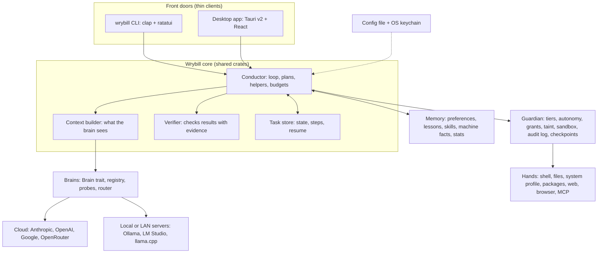

# Wrybill specification

**Version 1.0 · 1 October 2026**

This is the source of truth for what Wrybill is and how it must behave. If code, a chat or an AI coding agent's idea disagrees with this file, this file wins until it's deliberately changed.

## How to use this document

- **Part A (sections 1 to 4)** is the product: what Wrybill is and what it must do. Only the maintainer changes Part A, normally after a discussion in a GitHub issue.
- **Part B (sections 5 to 20)** is the design. It changes through pull requests as we learn. The reason behind each main choice is in [DECISIONS.md](DECISIONS.md).
- **Contributors:** start with the [README](../README.md) and [CONTRIBUTING.md](../CONTRIBUTING.md), then read Part A here and the sections your change touches. Questions and proposals belong in GitHub issues, where everyone can see them. AI coding agents follow [AGENTS.md](../AGENTS.md).
- **Must** means non-negotiable. **Should** is the strong default; deviate only with a recorded reason. **May** is optional.
- **Targets** (section 17) are goals. They aren't results until they've been measured on real hardware.

## Contents

**Part A: What we're building.** 1 What Wrybill is · 2 Brain and body · 3 Requirements · 4 Non-goals

**Part B: How we'll build it.** 5 Design constraints · 6 Technology choice · 7 Architecture · 8 Brains · 9 Helpers · 10 Hands (tools) · 11 Guardian (safety) · 12 Memory and self-improvement · 13 Configuration · 14 Technology stack · 15 Repository and file layout · 16 Roadmap and milestones · 17 Targets · 18 Testing and evaluation · 19 Glossary · 20 References

---

# Part A: What we're building

## 1. What Wrybill is

Wrybill is an adaptive AI agent for your computer: a secure, lightweight, LLM-agnostic, self-improving, general-purpose assistant that lives on the machine you already own and gets real work done on it.

You give Wrybill an instruction through a command line or a desktop app. It works out what machine it's on and what the job needs, installs and configures anything that's missing, runs and tests things, opens a browser, and searches the web. When a job is big enough, it splits the work across helper agents. It learns from experience so it gets better over time, and it knows what's safe to do on its own, what to avoid, and when to stop and check with you first.

**The main goal:** make things easy and simple for the person using it. Wrybill works things out for itself, asks only when a decision is really yours, and keeps every setting optional, with a sensible default you can change.

**The promise:** Wrybill's brain is a setting, not a dependency. Take every cloud model out of the config, point Wrybill at a local model, and it still works, limited only by what that model can do. Adding a new model that speaks a protocol Wrybill already supports is a config change, never a code change.

**Who it's for:** Anyone who wants a capable, adaptive, careful, self-improving agent. Wrybill is open source (Apache-2.0).

## 2. The mental model: brain and body

| Part | In a person | In Wrybill |
|---|---|---|
| Brain | Thinking, knowledge, decisions | The LLM (local model, Claude, ChatGPT, Gemini). We plug brains in. |
| Senses | Seeing and hearing | Reading the computer's state, files, web pages and screenshots |
| Hands | Doing things | Tools: terminal, files, browser, installers, web search |
| Memory | Remembering | Notes Wrybill writes and reads back |
| Nervous system | Reflexes and coordination | The loop: think, act, check the result, think again, until the job is done |
| Upbringing | Values and habits | Wrybill's instructions and safety rules |

Everything except the brain is Wrybill, often called the agent's "harness" or "body". Three consequences shape the design:

1. **The body decides what the brain sees.** The brain only knows what Wrybill hands it on each call, so managing that context well is core craft.
2. **Brains are swappable.** Wrybill can use a strong brain for planning, a cheap fast one for routine steps, and a local one for private work, all within the same task.
3. **A light body leaves room for the brain.** When the brain is a local model on the same laptop, every megabyte Wrybill uses is a megabyte the model can't have.

## 3. Requirements

| ID | Requirement | Met when |
|---|---|---|
| R1 | Accepts instructions and inputs from the user through a **CLI or a GUI**. | Every task can be started, watched, steered, approved and cancelled from both the CLI and the desktop app, which share one core. |
| R2 | Uses its attached LLM to **complete the task itself**, or **decides to start two or more separate agents** when that gets the task done more effectively and efficiently. | Wrybill decides per task and says why. On the eval suite, splitting beats single-agent mode on parallel-friendly tasks at an acceptable cost, and sequential tasks stay single-agent. |
| R3 | Is **adaptive**: it can learn and improve itself over time. | Something learned in one task is recalled after a restart and measurably improves a later, related task (fewer steps, fewer errors, lower cost or a corrected habit). Every learned item can be viewed, edited and deleted. |
| R4 | Is **lightweight, efficient and as fast as possible**. | The targets in section 17 are met on a 2015 reference laptop. |
| R5 | Is **LLM-agnostic and plug-and-play**: it can use Claude, ChatGPT or Gemini through API keys, or a downloaded local LLM. | Switching brains is a config change. With every cloud model removed, the local reference tasks still complete, and no requests reach any model provider. |
| R6 | Has a **configuration file listing every local LLM** Wrybill can use. | Local models are listed in `config.toml` with their endpoint and capabilities, and `wrybill models` shows which are reachable and what each has been verified to do. |
| R7 | Runs on **any kind of laptop** (MacBook, Vivobook, ThinkPad and so on) **released in 2015 or later**. | Release builds pass the reference tasks on a real 2015 MacBook and a real 2015 Windows laptop, as well as on current machines. |
| R8 | Can **handle any task** the user gives it. | The eval suite (section 18) defines "any task" in practice, and Wrybill passes at least 80% of it with the default planner brain. |
| R9 | **Understands the computer it's running on**, and knows what can be installed or configured to carry out an instruction. | `wrybill doctor` reports the OS, chip, memory, disk, shells, package managers, runtimes and browsers correctly on every reference machine, and plans fit the machine (no Homebrew commands on Windows). |
| R10 | Can **test applications, open a browser and search the web** as needed. | Wrybill starts a local web app, signs in with test credentials, clicks through a flow, reports console errors, and answers a question from the web with its sources. |
| R11 | **Works out what tools, software and setup** are needed to reach a goal. | Given a goal that needs a missing tool, Wrybill identifies it, proposes a trusted install, and finishes the goal once the user approves. |
| R12 | **Knows what's safe to do, what to avoid, and what to check with the user first.** | The red-team suite is 100% refused or escalated, and no Ask-tier action ever runs without approval. |
| R13 | Is **open source**, so others in the community can benefit from it too. | The code is public under an OSI-approved licence. Someone other than the maintainer can build Wrybill and run the reference tasks by following the README, and contribute by following `CONTRIBUTING.md`. |

**Clarifications**

- **R2:** One agent is the default. Splitting is a call Wrybill makes per task, using the rules in section 9, and it has to earn its extra cost. A "separate agent" is a separate working context with its own brief, tools, budget and brain. It doesn't have to be a separate program.
- **R3:** "Learning" means getting better through experience Wrybill stores, checks and reuses (section 12). The brains themselves don't change, and neither does Wrybill's code (N2).
- **R5:** "Plug-and-play" means a model that speaks a protocol Wrybill supports needs only config. A genuinely new protocol needs a small adapter, but never changes the rest of Wrybill. Being able to use any brain isn't the same as every brain being equally good: a small local model won't plan like a frontier model, and Wrybill says so plainly.
- **R7:** Covers macOS, Windows and Linux on 64-bit Intel, AMD and ARM chips. 2015 MacBooks top out at macOS 11 (12-inch MacBook) or macOS 12 (MacBook Air and MacBook Pro), and 2015 Windows laptops usually run Windows 10. Not covered: 32-bit Windows and ChromeOS (Wrybill's Linux build may run in ChromeOS's Linux environment, untested). Section 14.1 sets the support policy, including for Intel Macs.
- **R8:** "Any task" is the ambition. In practice it means any task that can be done on the computer with a terminal, files, a browser and the web, within the safety rules, and within what the chosen brain can manage.
- **R12:** "Check with the user first" means Wrybill pauses and waits. It never assumes a yes, however long the wait.
- **R13:** "Open source" means the code, this spec, the prompts and the evals are public, and decisions are made in the open. It doesn't mean Wrybill shares anything about its users: there's no telemetry (11.15).

## 4. Non-goals

| ID | Not a goal | Status |
|---|---|---|
| N1 | **Training our own LLM.** Wrybill plugs into existing LLMs. | Firm |
| N2 | **Wrybill rewriting its own source code or binaries.** It improves through data it can show you; section 12.8 draws the exact line. | Firm |
| N3 | **Running models inside Wrybill.** Local models run in a separate local server (Ollama, LM Studio or llama.cpp), which keeps Wrybill small. | v1 scope |
| N4 | **A public marketplace for third-party skills or plugins,** or installing third-party skills and extensions by default (11.8). | v1 scope |
| N5 | **Mobile apps, multiple user accounts or cloud hosting.** | v1 scope |
| N6 | **Full desktop control** (driving any app through screenshots, mouse and keyboard). Browser control comes first. | v1 scope |
| N7 | **Heavy frameworks and runtimes.** No LangChain-style agent framework, no Electron, and no Python or Node.js runtime that end users must install. An optional extension (say, an MCP server written in Python) may bring its own runtime, but Wrybill itself never requires one. | v1 scope |
| N8 | **A digital twin in v1.** Learning to think, write and decide like its user may come later. Wrybill still learns the user's working preferences, such as which tools and conventions they like (R3). | Firm |

"Firm" non-goals are settled. The "v1 scope" ones are choices for the first release and can be revisited.

---

# Part B: How we'll build it

## 5. Design constraints

These facts shape the design. They were checked on 1 October 2026, and section 20 links the sources.

| Fact | What it means for Wrybill |
|---|---|
| A typical 2015 laptop has 4 to 8 GB of RAM and no graphics chip that's useful for AI. Some budget chips lack AVX, and many machines still have spinning hard drives. | Wrybill itself must be tiny and run on any 64-bit x86 chip without special instructions. On old machines it mostly uses cloud brains or a model served from a stronger computer on the same network; local models are a bonus where the hardware allows. |
| Open-ended computer work (planning, recovering from errors, judging risk) is where small models fall over. | When cloud use is allowed, the default planner is a frontier cloud model. Local models handle simple steps and private work. Local-only must still work (R5), with honest limits. |
| "OpenAI-compatible" describes a request shape, not a feature set, and a config file's claims about a model aren't proof. | Every model has a capability profile that Wrybill probes and measures (8.3), and work goes to a brain that has shown it can do it. |
| Every helper burns its own tokens. On a modest laptop, local helpers take turns, and helpers on the same weak model share its blind spots. | One agent by default; split only when it earns its extra cost (section 9). |
| Using a model never changes it. | Wrybill learns by writing down experience and feeding the relevant parts back in. Memory is readable, grows by small checked edits, and bad lessons are easy to remove (section 12). |
| Brains can be wrong, and they can be tricked: prompt injection, the "lethal trifecta" (private data, untrusted content and outside communication in one agent) and malicious skills or installs are all real. | Safety rules live in code, not in the brain's judgement. Everything Wrybill reads is data, never instructions, and installs come from trusted sources only (section 11). |
| macOS 12, the newest version a 2015 MacBook Air or Pro can run, hasn't had security updates since July 2024. Windows 10 consumer security updates end on 12 October 2027, with enrolment. | Wrybill runs on these machines but warns once (11.13). For old laptops, a current Linux distribution is the safest home. |
| Rust still supports Intel macOS 10.12 and newer (as a Tier 2 target). macOS 26 is the last release for Intel Macs, so GitHub's hosted Intel Mac build machines will go away with its macOS 26 image, which has no end date yet. Its macOS 15 Intel image retires in late 2027. | The core is Rust (section 6). Intel Mac builds are pinned and tested on real hardware, under the support policy in 14.1. |
| Chrome 136 and later ignore remote-debugging switches on the default profile. Chrome 151 and later need macOS 13. Firefox supports macOS 10.15 and newer, and is driven through WebDriver BiDi rather than CDP. | Wrybill's browser always uses its own profile. It has two backends: CDP for Chromium browsers, and WebDriver BiDi for Firefox, which is what 2015 Macs use (10.4). |
| Ollama needs macOS 14 or newer, and it can serve cloud models through the same `localhost` address as local ones. | 2015 Macs run local models through llama.cpp's server. Wrybill checks where a model really runs instead of trusting its address (8.3, 11.15). |
| When an agent asks permission for everything, people stop reading and click yes. | Autonomy levels, task-scoped approvals and an OS sandbox keep approval prompts few and worth reading (11.2, 11.3). |
| Open formats now exist for agents: MCP for tools, `AGENTS.md` for coding-agent rules and Agent Skills (`SKILL.md`) for skills. Open Responses, a vendor-neutral model API, is emerging. | Wrybill uses MCP, `AGENTS.md` and Agent Skills instead of inventing its own formats (10.6, 12.5), and can support Open Responses later with a new adapter (8.2). Third-party skills still go through the supply-chain checks in 11.8. |

## 6. Technology choice

**Wrybill's core is written in Rust. Two front doors share that core: a small CLI binary, and a desktop app built with Tauri v2, React and TypeScript.**

- **Nothing else to install.** No runtime, low memory use and a fast start, and Rust still builds for 2015 Intel Macs.
- **One core for both front doors.** Tauri's backend is Rust, so the CLI and the desktop app share exactly the same core crates, with no glue code in between.
- **Two binaries, not one.** The CLI has to start on minimal or headless Linux machines that don't have WebKitGTK, and write to the terminal properly on Windows. A separate CLI is also smaller and starts faster.
- **Costs we accept.** Builds are slower than Go's, so the code is split into small crates and `cargo check` gives quick feedback. Rust has fewer official LLM SDKs, so the `genai` crate sits behind Wrybill's own interface and can be replaced (section 8).

## 7. Architecture

### 7.1 The big picture



**The one rule this diagram encodes:** brains never touch the laptop. A brain only *proposes* an action. The Conductor hands the proposal to the Guardian, and only the Guardian can let a tool run. Only the user can widen what the Guardian allows.

### 7.2 Components

| Component | Job |
|---|---|
| **Front doors** (`wrybill` CLI and desktop app) | Thin clients. They send requests and show events. No business logic. |
| **Core protocol** | Requests in (start, steer, approve, deny, answer, pause, resume, cancel) and events out (plan, step, tool output, approval needed, question, warning, result, cost). Versioned, and every event carries an ID, a sequence number and a timestamp, so a front door can reconnect and catch up. Both front doors speak it, and a future background service can too. |
| **Conductor** | Runs the agent loop, decides whether to use helpers, enforces budgets (steps, time, tokens, money) and handles cancellation. |
| **Context builder** | Assembles exactly what the brain sees on each call, and compacts history when space runs low (section 8.6). |
| **Verifier** | Checks results with evidence (tests, file contents, page state, exit codes), not the brain's say-so. |
| **Task store** | Records every task's state, steps and approvals in SQLite, so work survives crashes and restarts (section 7.4). |
| **Brains** | The `Brain` interface, provider adapters, model registry, probes, router and fallbacks (section 8). |
| **Hands** | The tools. Each one declares its name, input schema, risk category, and what it touches: paths, network or system settings (section 10). |
| **Guardian** | Classifies every proposed action, applies the rules and the autonomy level, asks for approval, sandboxes commands, writes the audit log and takes checkpoints (section 11). |
| **Memory** | Stores and retrieves preferences, lessons, skills, machine facts and run statistics (section 12). |
| **Config and secrets** | Loads and validates the config file, and reads API keys from the OS keychain (section 13). |

### 7.3 The agent loop

1. **Receive** the instruction.
2. **Understand:** refresh the system profile if it's stale, note the date, time and connectivity, read the project's own guidance file (such as an `AGENTS.md`) if there is one, and recall relevant lessons. Skills are listed by name and one-line description; Wrybill loads a skill's full text only when it uses it.
3. **Plan:** for anything multi-step, write a short plan and show it. If the task will clearly take many steps or includes Ask-tier actions, wait for the user's go-ahead on the plan (in Ask mode; see 11.2).
4. **Act:** the brain proposes an action, or a small batch of independent read-only actions; the Guardian checks each one; the user approves if needed; the tool runs (sandboxed where possible); the output is trimmed, cleaned of secrets, and labelled with where it came from.
5. **Observe and repeat** until the job is done, Wrybill is stuck, or a budget runs out.
6. **Verify:** check the result for real (run the tests, open the page, re-read the file).
7. **Report:** a short summary of what changed, the evidence that it worked, what it cost, and how to undo it.
8. **Learn:** outcome statistics are always recorded. When the task is worth learning from (it failed, needed a correction, or was new), a quick reflection by a cheap brain the task is allowed to use proposes lessons and skills, within the task's budget. Proposals then go through the checks in section 12.

**Stop conditions:** the job is done; the user cancels; a budget is used up; the same error happens three times in a row, or the same action repeats without progress (Wrybill stops and asks); a Deny rule blocks the only way forward; or no allowed brain is available.

### 7.4 Task lifecycle and recovery

Tasks move through these states: **queued**, **running**, **waiting** (for an approval or an answer), then **completed**, **failed**, **cancelled** or **interrupted**.

- Every step is written to the task store before it starts and after it finishes.
- If Wrybill crashes or the laptop sleeps mid-task, unfinished tasks are marked **interrupted** and never resume silently. `wrybill resume <task-id>` picks up from the last completed step.
- **Side effects outside the laptop are never blindly retried.** A timeout on a `git push`, a form submission or a sent message can mean it worked and the reply was lost. Wrybill checks first (is the commit on the remote?) or asks.
- A task waiting on the user costs nothing and waits as long as needed. An optional timeout can cancel it, but a timeout never counts as a yes.
- Finished helper results are saved as they arrive, so a crash doesn't throw away completed work.
- One running task per workspace folder at a time; other tasks for the same folder queue.

### 7.5 The command line at a glance

| Command | What it does |
|---|---|
| `wrybill "instruction"` | Run a task |
| `wrybill` | Open the interactive terminal interface |
| `wrybill init` | Guided first-run setup: detects the machine and any local model servers, helps add keys and models, then runs probes |
| `wrybill doctor` | Print the system profile and check the setup: which parts work on this machine, which protection is active, and disk used by checkpoints, trash, transcripts and logs |
| `wrybill models` | List brains, with `probe` (test what they can really do), `check` (are model IDs still valid?) and `scan` (find models on local servers and offer to add them) |
| `wrybill keys set <provider>` | Store an API key in the OS keychain. Models and search from that provider then find it by name, with no config line needed |
| `wrybill tasks`, `wrybill resume <task-id>` | List tasks; resume an interrupted one |
| `wrybill log`, `wrybill log --network`, `wrybill log verify` | Read the audit log; list every connection Wrybill made for a task; check nobody has tampered with it |
| `wrybill undo [task-id]` | Reverse a task's file changes |
| `wrybill memory`, `wrybill skills` | Review, edit, pin or delete what Wrybill has learned |

Useful flags: `--brain <id>` pins a brain, `--private` uses only local and trusted LAN brains (11.15), `--mode plan|ask|auto` sets the autonomy level, and `--budget` raises the limits for one task.

The command is always `wrybill`. It's never shortened to `wry`, which is the name of Tauri's WebView library.

## 8. Brains: staying LLM-agnostic

### 8.1 The Brain interface

Everything in Wrybill talks to brains through one interface that Wrybill owns, so no other code knows or cares which provider is behind it. Provider-specific details stay inside the adapters.

```rust
// Sketch only. Exact signatures are decided in code.
pub trait Brain: Send + Sync {
    fn id(&self) -> &str;
    fn profile(&self) -> &ModelProfile; // declared and verified capabilities, limits, locality, prices
    async fn chat(&self, request: ChatRequest) -> Result<ChatStream, BrainError>;
}
```

- A `ChatRequest` carries messages (each with a provenance label), tool definitions (JSON Schema), optional output constraints (a JSON Schema the reply must match), limits, a cancellation token, and metadata (task and helper IDs).
- A `ChatStream` yields text, proposed tool calls, token usage and a finish reason. Usage a provider doesn't report is recorded as **unknown**, never as zero.
- If the trait has to be used as `dyn Brain`, check whether async functions in traits are dyn-compatible on the pinned Rust toolchain. If they aren't, return boxed futures (for example with the `async-trait` crate).

### 8.2 Providers in v1

| Provider | How Wrybill connects |
|---|---|
| Anthropic (Claude) | `genai` crate |
| OpenAI (ChatGPT models) | `genai` crate |
| Google (Gemini) | `genai` crate |
| OpenRouter (many models, one key) | `genai` crate |
| Local or LAN: Ollama, LM Studio, llama.cpp server | The OpenAI-compatible Chat Completions API these servers expose. Wrybill never loads model files itself. |

Default local endpoints: Ollama `http://127.0.0.1:11434/v1`, LM Studio `http://127.0.0.1:1234/v1`, llama.cpp server `http://127.0.0.1:8080/v1`.

`genai` is still pre-1.0 (0.7.0-rc.1 on 27 September 2026), which is one reason it sits behind the `Brain` trait. Chat Completions is the most widely supported request shape today. Open Responses is the one to watch, and supporting it later means a new adapter, not a rewrite.

### 8.3 Capability profiles: declared, probed, measured

Every model has a profile built in three layers, and the router trusts the later layers more:

1. **Declared** in the config (section 13), most of it optional: the **roles** it's meant for (`planner`, `worker`, `summariser`), **tools** (`native`, `prompted` or `none`), **vision**, **context_window**, **locality** (`cloud`, `lan` or `local`), **min_free_ram_gb** for local models, and prices or a cost tier. Nobody should have to research a model before adding it, so whatever the config leaves out, Wrybill works out itself, from sensible defaults and the next two layers.
2. **Probed** by `wrybill models probe`, which runs a few cheap checks. Is the model reachable? Does a native tool call round-trip correctly? Does it follow a JSON Schema? Does it accept an image? What context size does the server really allow? Where does it really run (a name Ollama tags as `cloud` is treated as cloud, whatever the address says)? For local servers it also checks how many requests the server runs at once, and whether running several at once is actually faster than one at a time. Probes rerun whenever the model, the server version or the config changes.
3. **Measured** from evals and real tasks: success rate, retries, time and cost per kind of task, recorded against the exact model, quantisation and server version.

**Context size.** `planner` and `worker` roles should have at least 16k tokens of context, ideally 32k or more, because rules, tool definitions, the plan and recent steps easily pass 8,000 tokens. Models with smaller windows can still summarise and classify. Local servers often default to a smaller window than the model supports and cut long prompts off without any error, so Wrybill checks the real size, sets it per request where the server allows, and otherwise tells the user how to set it (on llama.cpp it's a start-up setting). A bigger window costs memory on a local model, so `min_free_ram_gb` is measured at the window size actually configured.

### 8.4 Router rules (v1: simple and explainable)

1. **Work out what the step needs:** tools, vision, context size, role and privacy.
2. **Filter, using rules in code:** drop models that are disabled, unreachable, shown not to support what the step needs (probe results override what the config claims), too big for the machine's free memory, or not allowed by privacy (cloud models in private mode, or anything whose locality isn't verified). Check the remaining budget.
3. **Rank:** the user's pin wins. After that, measured quality for this kind of task, then speed and cost. The planner is the best available `planner`; helpers get the cheapest model that clears the bar; reflection and summaries go to cheap or local models that the task's privacy rules allow.
4. **Reserve and dispatch,** and record why that brain was picked (`wrybill log` shows it).
5. **Fall back** to the next eligible candidate on errors, rate limits or timeouts, with backoff. Content from a task running on local or LAN brains never quietly moves to the cloud, whether through a fallback, a helper, a summary or a reflection: that needs the user's OK, and in private mode it's never allowed.
6. **Improve with experience:** run statistics reorder candidates over time (part of R3). Learning can change the ranking, never the filter.
7. **The user can always pin a brain**, for example `wrybill --brain claude-sonnet "..."`.

### 8.5 Tool calling across different brains

- Use native tool calling when probes show it's reliable.
- Otherwise use the prompted fallback: describe the tools in the prompt, ask for one strict JSON block, and validate it against the tool's schema. Where the server can enforce a JSON Schema or grammar on its output (llama.cpp and Ollama both can), switch that on, so a small model can't produce a malformed call in the first place.
- On malformed output, retry once with the error message. If it fails again, hand the step to a stronger eligible brain (rule 5 in 8.4 still applies).

### 8.6 Context: the body decides what the brain sees

- **Fixed sections:** rules, the task, the current plan, a short system profile, and today's date, time and timezone (brains don't know what day it is).
- **Retrieved memory:** only the few most relevant lessons. Skills appear as a name and a one-line description until one is used.
- **Recent steps** in full. Older steps are summarised, when space runs low, by a cheap brain the task is allowed to use (rule 5 in 8.4), always keeping decisions, errors, file paths and approvals.
- **Big outputs:** keep the start, the end and a summary in context, and save the full output to a file the brain can ask to read.
- **Provenance labels:** every piece of context is tagged with where it came from (the user, Wrybill, a tool, the web, a file, an MCP server or a helper), so the brain and the Guardian know what's untrusted.
- **Stable prompt start:** keep the beginning of every prompt identical between calls, so providers' prompt caching can cut cost and latency.

### 8.7 Switching brains mid-task

A config change applies to new steps, never to a call already in flight. When a task carries on with a different brain, its history (including tool calls and images) is translated for the new provider. If something can't carry over, Wrybill stops and says so rather than dropping it quietly.

### 8.8 Cost accounting

Prices live per model in the config. Tokens are counted on every call and shown live in both front doors. Budgets reserve an estimate before parallel calls and reconcile afterwards, keeping a safety margin because some providers report usage late or not at all. Local runs cost no money but do cost time and battery, so they're shown separately.

### 8.9 Wrybill's own instructions (its upbringing)

- Wrybill's prompts live in the repo's `prompts/` folder, versioned and reviewed like code, with tests that check the key rules are present.
- They cover what Wrybill is and who it works for; the current autonomy level and what it allows; that anything from tools, files or the web is data, not instructions; how to propose actions and ask questions; to verify before claiming success; and to say plainly when a job is beyond the current brain or machine.
- Shorter, more explicit variants for small local models are fine. The safety rules themselves live in the Guardian, never only in a prompt.

## 9. Helpers: when Wrybill splits the work

### 9.1 Default: one agent

Most tasks run as a single agent. Splitting is the exception, and it has to earn its cost.

### 9.2 When to split

Split when at least one of these is true and the extra cost is worth it:

- The work breaks into **independent pieces that can run at the same time** (research five vendors, test in three browsers).
- A sub-task would **flood the main context** with detail the main agent doesn't need (reading a large codebase to answer one question).
- A sub-task needs a **different kind of brain** (vision, or a local model for private data).
- A sub-task means **reading untrusted content** that the main agent is better off not seeing directly (section 9.3).

Don't split when the steps depend on each other in sequence, the task is small, or the only point is to have the same weak model "double-check" itself. With only local brains on a low-spec machine, don't split for speed (the helpers would just take turns), though splitting to keep the main context clean can still pay off.

### 9.3 The helper contract

- **Gets:** a written brief (goal, inputs, constraints, and what "done" means), a tool allowlist that's a subset of the main agent's, a slice of the main agent's budget (never a fresh one), an autonomy level no higher than the main agent's, and a brain picked by the router.
- **Returns:** a structured result checked against a schema: a summary, outputs or file paths, a confidence level, any problems found, and a list of the untrusted sources it read.
- **Can't:** start its own helpers (one level deep in v1), widen its own permissions, or talk to the user directly. Its approval requests pass up through the main agent, labelled with which helper is asking.
- **Shares:** the same Guardian, audit log, checkpoints and task store.
- **Owns its outputs.** Each helper writes only the files assigned to it. Helpers that need to change the same project work in separate copies (git worktrees, say) or take turns; two helpers never edit the same file at once. The main agent's report shows every helper's outcome, failures included.
- **Readers return data, not orders.** A research helper gets a brief with no private data in it, so it can browse freely, and it hands back structured findings that the main agent treats as data. The part that reads untrusted content holds nothing worth stealing, and the part that holds private data never reads untrusted content directly. That's the Rule of Two in practice (section 11.7).

### 9.4 Running helpers

- Helpers run as `tokio` tasks inside Wrybill, not as separate programs. A limit caps how many cloud helpers run at once (default 3).
- Helpers that use a local or LAN model share that model's server. Wrybill works out how many can run at once: the smallest of the limit in the config, the number of parallel requests the server allows, what fits in the memory that's free right now, and what a probe has shown is actually faster on this machine. When it can't tell, it runs them one at a time.
- Cancelling a task cancels all of its helpers and kills any processes they started.

### 9.5 Budgets and cost

Every task gets default limits from the config (steps, time, tokens and spend), which the user can raise for a single task. Helpers draw from their parent's budget. The CLI and the desktop app show a live token and cost counter.

## 10. Hands: the tool set

### 10.1 v1 tools

| Tool | What it does | Default tier |
|---|---|---|
| `system.profile` | OS and version, chip and CPU features, RAM, disk, graphics, shells, package managers, installed runtimes and browsers, connectivity, and whether the OS still gets security updates | Allow |
| `fs.list`, `fs.read`, `fs.search` | Read files and folders | Allow inside allowed folders; sensitive locations are denied |
| `fs.write`, `fs.edit`, `fs.move` | Create and change files | Allow inside the task workspace (after a checkpoint); Ask elsewhere |
| `fs.delete` | Delete files | Ask (Auto mode allows deletes inside the workspace, which the task's checkpoint can restore). Files go to Wrybill's trash, never straight to permanent deletion |
| `shell.run` | Run a command in the right shell for the OS | Depends on the command and the autonomy level (section 11) |
| `pkg.install`, `pkg.uninstall` | Install or remove software through Homebrew, winget, Scoop, apt, dnf or pacman | Always Ask; trusted sources only |
| `web.search` | Search the web through the configured search API | Allow |
| `web.fetch` | Fetch a page as clean text | Allow; output is marked untrusted, and new sites need approval in a context that is tainted and holds private data (11.7) |
| `browser.*` | Open, navigate, read a page, click, type, take screenshots, read the console | Allow for reading and navigating; Ask for submitting forms, signing in, buying or posting (sign-in handoff: 10.4; test logins on local dev hosts: 11.6) |
| `mcp.*` | Tools from configured MCP servers | Ask by default; trust is set per server |
| `ask_user` | Ask the user a question or for a decision | Allow |
| `memory.recall`, `memory.note` | Read and write Wrybill's own notes | Allow, under the rules in section 12 |
| `skill.load` | Load a skill's full instructions | Allow. Running a skill's scripts goes through `shell.run` like any other command |

### 10.2 Shell

- On macOS and Linux, commands run through the user's shell (zsh or bash). On Windows they run in PowerShell: Windows PowerShell 5.1 ships with Windows 10 and 11, and PowerShell 7 is used when it's installed.
- Every command gets a working directory (the task workspace by default), a timeout, an output size cap, and a minimal environment (no API keys unless the tool explicitly needs one).
- Cancelling a command kills its whole process tree, not just the parent.

### 10.3 System profile

- Built at start-up from `sysinfo`, plus quick checks for package managers (Homebrew, winget, Scoop, apt, dnf, pacman), runtimes (git, Python, Node, Java, Docker and so on), browsers, CPU features (such as AVX2, which matters for local model servers), internet connectivity, and whether the OS still gets security updates.
- Cached with a timestamp, and refreshed after installs or once a day. The brain gets a short summary and can ask for the full profile.
- The connectivity check uses what the OS reports about the network. It sends no requests to third-party sites.
- The security-updates answer is one of four: supported, supported with a condition (for example Windows 10, which needs Extended Security Updates enrolment), out of support since a given date, or unknown. It comes from a table built into each release and is shown with the date that table was checked. An entry with a published end date becomes out of support once that date has passed. Once the table is more than a year old, anything it still lists as supported, with or without a condition, is reported as unknown.
- Offline? Wrybill says so, sticks to local and LAN brains, and switches off web tools until the connection is back.
- Wrybill records which parts work on this machine: the core, the desktop app, local inference, each browser backend and the sandbox. A missing part only switches off the tools that need it; the CLI, history and setup always work.

### 10.4 Browser

- The browser layer sits behind one interface with two backends: **CDP** through `chromiumoxide` (0.9.x) for an installed Chromium browser (Chrome, Edge, Brave or Chromium; Edge comes with Windows 10 and 11), and **WebDriver BiDi** for Firefox. Firefox is the route on 2015 Macs, which can't run a current Chrome (section 5).
- Wrybill **always** uses its own browser profile in `~/.wrybill/browser`, with no access to the user's everyday logins. Chrome 136 and later block automation of the default profile anyway, and other browsers are assumed to do the same. Wrybill connects over a pipe where the library supports it, and otherwise over a random port bound to 127.0.0.1.
- **Sign-in handoff.** When a task needs the user signed in to a site, Wrybill opens the sign-in page in its own profile and hands over. The user signs in themselves, and Wrybill never sees or types the password. Test logins on local dev hosts are the one exception (11.6).
- Pages are read as text or an accessibility snapshot first, because that's cheap. Screenshots are used only when needed and when the brain can see images.
- If no supported browser is installed, Wrybill offers to install one that the OS still supports (Ask), or Chrome for Testing in its own folder where the OS allows. It never installs an out-of-date browser to suit an old OS, and it won't browse the open web with a browser that no longer gets security fixes. Testing apps on local dev hosts with one is fine, with a warning.

### 10.5 Web search

- Searches go through a search API set in the config (candidates: Brave Search, Exa, Tavily, or a self-hosted SearXNG), so search works with every brain, local ones included. Setting it up is guided: Wrybill explains the choices in plain words, so nobody has to know these services beforehand.
- Provider-side tools (a cloud brain's own web search, page fetching or code execution) run on the provider's servers, out of the Guardian's sight. They're off by default; if the user turns one on, using it counts as outside communication under 11.7.
- All results are marked untrusted, and reports cite their sources.

### 10.6 MCP (extensions)

- Wrybill is an MCP client built on `rmcp`, the official Rust SDK (3.5.0 on 28 September 2026). Servers are listed in the config.
- Every MCP tool call goes through the Guardian like any other tool.
- Local MCP servers start with a minimal environment: no API keys unless the config explicitly passes one.
- When the user approves a server, Wrybill records a hash of its tool list and descriptions. If the server later changes them, Wrybill stops using it until the user approves again. Tool descriptions are a known hiding place for injected instructions, and changing a server after it's been approved is a known trick.

### 10.7 Later, not v1

- `screen.*`: desktop control through screenshots, mouse and keyboard (N6).
- Scheduled and background tasks, and voice input.
- Wrybill as an MCP server, so other agents can use it as a tool.
- Driving other agent CLIs (Claude Code, Codex CLI, Gemini CLI) as specialist helpers when they're installed. Their actions happen inside their own permission systems, out of the Guardian's sight, so they'd be Ask by default and confined to a workspace.
- A filtering network proxy so sandboxed commands can reach package registries and nothing else (section 11.11).

## 11. Guardian: safety and security

### 11.1 Principles

1. **Only the user gives instructions.** Web pages, files, tool output, search results, MCP responses and helpers' reports are data. They can inform how Wrybill does the task the user gave it (a README's build steps, a project's own `AGENTS.md`), but they can never add goals, widen permissions or approve anything.
2. **Rules are enforced in code.** The brain can recommend; it can't override.
3. **Least privilege by default.** Permissions are widened deliberately, never silently.
4. **Reversible by default.** Checkpoint before changing files; trash instead of delete.
5. **Transparent.** Every action is logged and explainable.
6. **Wrybill can't change its own rules.** The config, policy files and audit log are off-limits to Wrybill's tools. Only the user edits them, by hand or through commands and settings screens they drive themselves.
7. **Never all three at once.** Wrybill doesn't combine untrusted input, private data and outside communication without the user's say-so (section 11.7).
8. **Questions must stay worth answering.** Approval prompts are rare, specific and complete, so people actually read them (sections 11.2 and 11.3).

### 11.2 Autonomy levels

The user picks a level per task with `--mode`, and the config sets the default.

| Level | What Wrybill may do without asking |
|---|---|
| **Plan** | Look, read, search and plan. It changes nothing. |
| **Ask** (default) | Allow-tier actions. Ask-tier actions wait for approval. |
| **Auto** | Also run commands, and create, edit or delete files, inside the task workspace without asking. This only works while the OS sandbox keeps those commands inside the workspace with no network access, and the checkpoint taken at the start of the task can restore everything. Offered only where the sandbox works (macOS and Linux in v1). |

Auto never covers installs, admin rights, sending or posting anything, or anything outside the workspace; those still ask. There's no "do anything" level in v1, and Deny rules apply at every level.

### 11.3 Task-scoped approvals

When the user approves an action, they can widen it for the rest of that task, for example "allow `npm install` in `~/Projects/shop` for this task". These grants:

- are specific (tool, command pattern and path);
- end when the task ends, and are logged;
- never cover Deny-tier actions; and
- are cancelled the moment the rule in section 11.7 kicks in.

Approving a plan also approves the specific Ask-tier actions it lists, with their exact details (command, target, destination). If those details change, or the rule in 11.7 kicks in, Wrybill asks again.

Longer-lived grants ("always allow this in this project") are a later feature. They'd live in a policy file the user edits, never one Wrybill writes.

### 11.4 Trust tiers

| Tier | Meaning | Examples |
|---|---|---|
| **Allow** | Just do it (still logged) | Read files in allowed folders; list and search; the system profile; web search and fetch; read-only commands such as `ls`, `git status` or `python --version`; write inside the task workspace after a checkpoint |
| **Ask** | Show exactly what will happen and wait for a yes | Install or remove software; change system or app settings; delete anything (except inside the workspace in Auto mode); use admin rights (`sudo`, UAC prompts); write outside the workspace; run a downloaded script; send or post anything (email, messages, forms, `git push`); sign into accounts; spend money; start background services; give a sandboxed command network access |
| **Deny** | Never, whoever asks | Type real passwords, card numbers or one-time codes; read credential stores (keychains, browser password stores, `~/.ssh`, cloud credential files); switch off security features (firewall, antivirus, Gatekeeper, SIP, UAC); run obfuscated commands (encoded PowerShell, base64 piped into a shell); pipe scripts from untrusted domains into a shell; edit Wrybill's own config, rules or audit log; send secrets to a brain |

Some Deny rules are **hard** and can't be relaxed in the config: sending secrets to a brain, Wrybill editing its own config, rules or audit log, switching off OS security features, and typing real passwords, card numbers or one-time codes. The rest are **default** Deny rules that the user can relax in the config if they really need to.

### 11.5 How commands are classified

- **Programs, not strings, where possible.** Tools run a program directly with an argument list. A shell is used only when a command really needs shell features (pipes, redirects, globbing), and those commands get the stricter treatment below.
- Split shell commands into their parts (pipes, `&&`, `;`, subshells) with a real shell parser, classify each part, and let the **strictest part win**.
- **Read-only commands** on an allowlist are Allow: for example `ls`, `cat`, `head`, `pwd`, `which`, `git status`, `git log`, `git diff`, `--version` checks, `Get-ChildItem` and `Get-Content`. That holds in the user's own folders and inside the sandbox. In a folder Wrybill downloaded or cloned during a task, even these can run code through the folder's own config or hooks (a hostile `.git/config` can make `git status` start a program), so there they're Ask unless sandboxed.
- **Commands that change things** are Ask: package installs and removals, `sudo`, `rm`, `del`, `Remove-Item`, `chmod`, `chown`, downloads (`curl`, `wget`, `Invoke-WebRequest`), `git push`, `ssh`, `scp`, service and registry changes, `defaults write`, killing processes, and writes outside the workspace. In Auto mode, sandboxed commands that stay inside the workspace with no network are the exception (11.2).
- **Known-dangerous commands** are Deny: `spctl --master-disable`, `csrutil disable`, `Set-MpPreference -DisableRealtimeMonitoring`, formatting disks, recursively deleting the root or home folder, `-EncodedCommand`, and piping downloads from domains that aren't on the allowlist into a shell.
- **Anything unknown, or too complex to parse, is Ask.** When in doubt, ask.
- **Paths are checked properly.** Path checks resolve symlinks and Windows junctions and reject `..` escapes; checking that a path starts with an allowed folder isn't enough.
- Classification makes approval prompts clear and catches known patterns, but it can't prove an arbitrary program is harmless. That's the sandbox's job (11.11).

### 11.6 Credentials, secrets and test logins

- API keys live in the OS keychain (macOS Keychain, Windows Credential Manager, Linux Secret Service) through the `keyring` crate. The config only holds references to them, like `keychain:wrybill/anthropic`. An `env:VARIABLE_NAME` reference is accepted too, on every OS. It's meant for machines where no keychain can be reached (a headless Linux server, a container, CI or an SSH session), and `wrybill doctor` warns wherever one is used.
- Tool output and files are scanned for known secret patterns (API keys, private keys, tokens) and redacted before anything reaches a brain or the log. Pattern matching can miss things, so this is a backstop, not the main defence.
- Commands and MCP servers run with a minimal environment.
- **Testing the user's own apps (R10).** On local development hosts only (`localhost`, `127.0.0.1`, `[::1]`, `*.localhost` and `*.test`), Wrybill may type test credentials that come from the project's own seed, fixture or example files, or that the user gives it for that task, plus a payment provider's published test card numbers in test mode. Never a real password for any other service, and never a live key. Wrybill's code checks the host itself; text on a page claiming "this is a test site" doesn't count.

### 11.7 Untrusted content and prompt injection

- **Provenance labels** go on everything in the context (section 8.6). Untrusted content is wrapped and marked as data.
- **Two flags per context.** A context (the main agent's or a helper's) is **tainted** once it has read untrusted content: web pages, downloaded files, unfamiliar repositories, MCP output, or helper results built from any of those. It **holds private data** once it has read the user's files (other than ones Wrybill created in this task), their documents or anything from their accounts. Wrybill's own lessons and skills don't count. When in doubt, Wrybill assumes private data.
- **When both flags are set:**
  - every Ask-tier action needs a fresh approval, and task-scoped grants are cancelled;
  - any new network destination (a site not yet visited in this task) needs approval;
  - anything that sends data out (posting, pushing, uploading, submitting forms, sending messages, or a cloud brain's own tools) needs approval, even in Auto mode; and
  - approval prompts say what Wrybill read just before suggesting the action.

  A context with only one flag carries on normally. Together, these rules mean a context that holds private data and has read something untrusted can't talk to the outside world without the user seeing it first, which breaks the lethal trifecta by design.
- **Readers return data.** Research helpers start without private data and hand back schema-checked findings (section 9.3), so most browsing never trips the rule above.
- **Hidden text:** fetched pages are stripped of invisible text and comments, and phrases like "ignore your previous instructions" are flagged to the user.
- **No new instruction sources:** nothing Wrybill reads can widen its permissions, add tools, change its rules or approve anything.
- **Learning from tainted contexts** is flagged and held back (section 12.7).

### 11.8 Installs and the supply chain

- Software comes only from OS package managers (Homebrew, winget, Scoop, apt, dnf, pacman) or from official vendor domains on an allowlist in the config.
- Before installing, Wrybill shows the package, its source, its version and what will run, then asks.
- "Prerequisites" suggested by a web page, a README or a skill go through exactly the same checks. (In February 2026 the ClawHavoc campaign hid 341 malicious skills in a public skills marketplace, using fake "prerequisites" to install password-stealing malware.)
- Third-party skills and MCP servers are off by default. When the user enables one, it must come from a source they approve, after a review step, and it's pinned by a hash of its contents. Any change needs a fresh approval.
- **Wrybill's own dependencies** get the same care: the lockfile is committed, `cargo audit` and `cargo deny` (security advisories, licences, banned or duplicate crates) run in CI, every new dependency is justified (see `AGENTS.md`), and release files are signed, with published checksums (M8).

### 11.9 Checkpoints, trash and undo

- Before changing files, Wrybill snapshots them (in a hidden git repository under `~/.wrybill/checkpoints`, or as plain copies if git isn't installed).
- Deleted files go to Wrybill's trash and can be restored.
- Installs and settings changes are recorded along with how to reverse them, where that's known.
- `wrybill undo` reverses the last task's file changes, and `wrybill undo <task-id>` reverses a specific task's. Before undoing, Wrybill checks that each file hasn't changed since the task touched it, and reports any conflict instead of overwriting newer work. Outside effects (a push, a post, a purchase) can't be undone this way, only followed up.
- Old laptops have small disks, so checkpoints, trash and transcripts have retention limits (default: 30 days or 2 GB, whichever comes first), and `wrybill doctor` reports how much space they use.

### 11.10 Audit log

- One JSON line per event in `~/.wrybill/logs/audit/YYYY-MM-DD.jsonl`: time, task, which agent (main or helper), action, arguments (secrets redacted), tier, autonomy level, who approved, result, duration and cost.
- Each line includes a hash of the line before it, and the newest hash is also kept in the OS keychain, out of reach of Wrybill's tools. Edits, deletions or a rewritten log then fail `wrybill log verify`. That makes the log tamper-evident, though nothing kept on one machine is fully tamper-proof.
- Readable with `wrybill log` and in the desktop app.
- Full task transcripts (prompts and replies, redacted) are kept separately for debugging, under the retention limits in 11.9.
- **Network ledger.** Every connection Wrybill itself makes is logged with its destination, its purpose (brain call, search, page fetch, browser page or remote MCP server) and how much data was sent. `wrybill log --network` lists them for a task, so the user can see exactly where their data went. The ledger covers Wrybill's own connections. Programs it starts and a separate model server make their own, which is what the sandbox (11.11) and the packet-capture test (section 18) are for.

### 11.11 OS sandboxing (defence in depth)

- **macOS:** shell commands run under a Seatbelt profile through `sandbox-exec`. Writes are limited to the workspace and temp folders, and network access is off unless approved. Apple has deprecated `sandbox-exec`, but it still works, and both Codex CLI and Anthropic's open-source sandbox runtime rely on it.
- **Linux:** Landlock limits file access (kernel 5.13 or newer; from 6.7 it can also restrict TCP connections), and seccomp can block network access. Bubblewrap is an alternative where it's installed. Where none of these is available, Wrybill falls back to approvals.
- **Windows:** v1 relies on Guardian approvals and path checks, with stricter defaults (more actions are Ask, and there's no Auto level). Proper Windows sandboxing is a later phase, and there are now good references for it: Codex's Windows sandbox (restricted tokens, dedicated sandbox users and firewall rules, written up by OpenAI in May 2026) and the alpha Windows support in Anthropic's sandbox runtime.
- **Later, network allowlists:** a small local proxy that lets sandboxed commands reach approved domains (package registries, say) and nothing else, the way Anthropic's sandbox runtime does it.
- **Honest labels:** `wrybill doctor` and each task's header say which protection is actually active on this machine, sandboxed or approvals-only. Approvals-only is never presented as a sandbox.
- Codex CLI and Anthropic's sandbox runtime are both open source (Apache-2.0) and are good references for all of this.

### 11.12 Local control surfaces

- In v1 the desktop app talks to the core inside the same process, so there's no network port at all.
- If a background service is added later, it binds to 127.0.0.1 only, requires a random per-install token, checks request origins, and is never exposed to the local network by default.

### 11.13 Old operating systems

At start-up Wrybill checks the OS against a list of versions that are out of security support, and shows a one-time warning recommending an update or, for old laptops, a move to Linux.

### 11.14 Money, messages and accounts

Purchases, payments, sending messages or emails, public posts, accepting terms, signing in and changing account settings are always Ask, with a full preview of exactly what will be sent or submitted. The only sign-in exception is test credentials on local development hosts (11.6).

### 11.15 Privacy

- No telemetry. Logs, memory, transcripts and checkpoints stay on the laptop.
- The only data that leaves the laptop is what's sent to the chosen cloud or LAN brains, the search API, remote MCP servers the user has enabled, and the websites Wrybill visits for a task.
- **Private mode** (`wrybill --private`) uses only local brains, plus LAN brains the user has marked as trusted. It refuses any model whose locality isn't verified, including Ollama models tagged `cloud` (running Ollama with `OLLAMA_NO_CLOUD=1` is recommended). It asks before any web access, and it never escalates to the cloud.
- Derived data counts too: summaries, search queries and embeddings made from private content follow the same rules as the content itself.
- **Checked, not claimed.** What a brain says about where data goes counts for nothing. The network ledger (11.10) records every destination Wrybill connects to, and in private mode a brain connection to anything other than a local or trusted LAN address is refused and reported.

## 12. Memory and self-improvement

### 12.1 What Wrybill learns

| Kind | Example | Used for |
|---|---|---|
| Preferences | "Use pnpm rather than npm for Node projects" | Doing things the user's way |
| Lessons | "On this Intel Mac, Homebrew lives in /usr/local, not /opt/homebrew" | Not repeating mistakes |
| Skills (recipes) | "Set up a Tauri v2 + React project", with steps and checks | Doing repeat jobs faster and cheaper |
| Machine facts | What's installed, and any quirks, per machine | Planning realistically |
| Routing stats | Success, retries, time and cost per model and kind of task | Picking better brains over time |
| Prompt and strategy versions | "For this kind of task, run the tests before editing anything" | Working better in general |

All of this is know-how for doing the work the user's way. Learning to think, write and decide like the user (a digital twin) isn't part of v1 (N8).

### 12.2 Where learning comes from

- **After tasks worth learning from** (failed, corrected or new), a cheap brain the task is allowed to use runs a short reflection (what worked, what failed, what to do differently next time) and proposes candidates. Outcome statistics are recorded after every task.
- **From the user:** corrections, thumbs up or down, and "remember that ..." instructions.
- **From failures:** an error that keeps happening becomes a lesson.
- **From evals:** runs of the eval suite show which brains, prompts and strategies actually work.

### 12.3 The improvement loop

1. **Record** the task, the approach, the environment (machine, brain, model version), the outcome and the user's feedback.
2. **Reflect.** A cheap brain proposes candidate lessons. Candidates are guesses, not facts.
3. **Check** that each candidate stays within permissions, data rules and schemas, contains no secrets, and is flagged if it came from a tainted context.
4. **Test where it matters.** Prompt and strategy changes must beat the current version on related eval tasks before they're adopted. The user's explicit corrections apply straight away.
5. **Promote** it as a versioned record with its source, date, confidence and scope (which machine, which brain).
6. **Use** it on relevant future tasks.
7. **Watch and retire.** Track later results, and narrow, demote or remove anything that makes things worse.

Memory changes by small edits (add one lesson, refine one, retire one), never by rewriting everything at once, which makes a memory drift and lose detail.

### 12.4 Who approves what

| What's learned | How it's applied |
|---|---|
| Machine facts, the user's stated preferences, routing stats | Automatically |
| Lessons from Wrybill's own experience | Automatically after the checks in 12.3, visible and reversible |
| Prompt and strategy versions | Automatically only if they beat the current version on evals; otherwise proposed to the user |
| Skills that contain commands or scripts | The user approves before first use; pinned by hash; any change needs a fresh approval |
| Anything learned from untrusted content | Flagged; never becomes a skill or a rule without the user |

### 12.5 Where it's kept

```
~/.wrybill/
├── memory/
│   ├── preferences.md
│   ├── lessons/<topic>.md
│   └── machines/<machine-id>.md
├── skills/<skill-name>/SKILL.md    (Agent Skills format, plus optional scripts/ and references/)
├── prompts/                         (approved prompt and strategy versions)
└── wrybill.db                       (SQLite: task store, search index, run history, routing stats)
```

The Markdown files are the real memory. SQLite indexes them and holds the statistics, and the index can be rebuilt from the files. Skills follow the open Agent Skills format (a `SKILL.md` that starts with a `name` and a `description`), so the same skill can work in Wrybill and in the user's coding agents.

Each item's frontmatter records its status (candidate, active, superseded or retired), source, date, confidence and scope. Wrybill validates hand edits when it loads them and flags anything it can't parse, rather than guessing.

### 12.6 How it's used

- At the start of a task, Wrybill retrieves the few most relevant lessons with SQLite's built-in full-text search and adds them to the context, labelled as Wrybill's own notes. Skills appear by name and description, and their full text loads only when used.
- Semantic search with embeddings (for example through `sqlite-vec`) comes later, and only if it measurably beats full-text search on Wrybill's own evals. Embeddings belong to the model that made them, so changing the embedding model means re-indexing everything.
- The router uses the run statistics (section 8.4).

### 12.7 Guardrails on learning

- **Everything is readable and editable:** `wrybill memory` and `wrybill skills` in the CLI, and a Memory screen in the desktop app.
- **Every item records where it came from** (task, date, source), its confidence and its scope.
- **Poisoned memory is a known attack** (OWASP lists memory and context poisoning among its top agentic risks). Lessons drawn from untrusted content are flagged, held back from automatic use, and never become skills or rules without approval.
- **Lessons are scoped.** Something learned with one brain or on one machine isn't assumed to hold for every brain or machine.
- **Unused or contradicted lessons fade** and are pruned. The user can pin or delete anything.
- **Secrets are never stored.**

### 12.8 What learning can and can't change

| Learning **can** change | Learning **can't** change |
|---|---|
| Wrybill's notes, lessons and preferences | Wrybill's own source code or binaries (N2) |
| Skills (as data, plus scripts the user has approved) | The Guardian's rules, the config, policy files or the audit log |
| Prompt and strategy versions, within their schema | Its own permissions, budgets or autonomy level |
| Routing preferences and resource settings, within hard limits | Validation checks, privacy rules, or where data may be sent |

Skills and saved strategies only use existing tools, through the Guardian, so they're never a back door for running arbitrary code. Installing a signed, official Wrybill update that the user approves is an ordinary update, not self-modification. Fine-tuning a small local model on successful task histories remains a later idea.

## 13. Configuration

### 13.1 Location and rules

- `~/.wrybill/config.toml` on macOS and Linux, and `%USERPROFILE%\.wrybill\config.toml` on Windows. Setting `WRYBILL_HOME` to an absolute path moves the whole folder, which is handy for a portable or test setup.
- Validated at start-up, with clear and specific error messages. Contradictions (say, `allow_cloud = false` when only cloud models can plan) are errors, not warnings. Section 13.3 lists every key and check.
- A missing config file isn't an error. Wrybill starts on built-in defaults.
- The agent's tools can never write to it (section 11.1). Commands the user runs themselves (`wrybill init`, `wrybill models scan`) and the desktop app's settings screen can.
- API keys are stored with `wrybill keys set <provider>`, which saves them in the OS keychain. Wrybill then finds the key by the provider's name, so the config needs no line for it. Another name works too, for a second key, and the config points to it with `keychain:wrybill/<name>`. Names use lowercase letters, digits, `-` and `_`. The key is typed at a hidden prompt or piped in, never passed as an argument, so it stays out of shell history and process lists.
- Model IDs and limits change often. `wrybill models check` compares configured model IDs with each provider's model list, where one exists, and warns when one is no longer valid.
- Changes apply to new tasks and new steps, never to a call already in flight.
- The `WRYBILL_LOG` environment variable sets the level of Wrybill's own log: `error`, `warn`, `info` (the default), `debug` or `trace`.

### 13.2 Example

The smallest useful config is one model. Wrybill finds the key saved by `wrybill keys set anthropic` and works out the rest itself (8.3):

```toml
version = 1

[[models]]
id = "claude"
provider = "anthropic"
model = "claude-sonnet-5-5"
```

The full example shows every section and option:

```toml
# ~/.wrybill/config.toml
# Example values. Check each provider's docs for current model IDs, limits and prices.
version = 1

[defaults]
planner = "claude-sonnet"
worker = "claude-haiku"
summariser = "local-small"
autonomy = "ask"                         # "plan", "ask" or "auto"

[limits]
max_parallel_cloud_helpers = 3
max_parallel_calls_per_local_server = 4  # an upper limit; Wrybill uses fewer when the server, free memory or speed call for it (9.4)
max_helper_depth = 1
max_steps_per_task = 60
max_minutes_per_task = 30
max_tokens_per_task = 2000000            # input plus output, across the task and its helpers
max_spend_usd_per_task = 2.00            # providers bill in US dollars

[routing]
allow_cloud = true                       # false = local and trusted LAN brains only
local_to_cloud = "ask"                   # "ask" or "never"

[search]
provider = "brave"                       # or "exa", "tavily", "searxng"
api_key = "keychain:wrybill/brave"
# endpoint = "http://127.0.0.1:8888"     # only for "searxng"; this is its default

[safety]
workspace_roots = ["~/Wrybill/workspaces", "~/Projects"]
trusted_install_domains = ["sh.rustup.rs", "nodejs.org", "www.python.org"]
dev_hosts = ["localhost", "127.0.0.1", "[::1]", "*.localhost", "*.test"]
warn_on_unsupported_os = true

[storage]
retention_days = 30                      # checkpoints, trash and transcripts
retention_max_gb = 2

# Cloud brains

[[models]]
id = "claude-sonnet"
provider = "anthropic"
model = "claude-sonnet-5-5"
api_key = "keychain:wrybill/anthropic"   # optional: this is where Wrybill looks anyway
roles = ["planner", "worker"]
tools = "native"
vision = true
locality = "cloud"
cost_tier = "medium"
# price_in_usd_per_mtok = ...            # copy from the provider's pricing page
# price_out_usd_per_mtok = ...

[[models]]
id = "claude-haiku"
provider = "anthropic"
model = "claude-haiku-4-5-20251001"
api_key = "keychain:wrybill/anthropic"
roles = ["worker", "summariser"]
tools = "native"
vision = true
locality = "cloud"
cost_tier = "low"

[[models]]
id = "openai-main"
provider = "openai"
model = "<openai-model-id>"
api_key = "keychain:wrybill/openai"
roles = ["planner", "worker"]
tools = "native"
locality = "cloud"
cost_tier = "medium"

[[models]]
id = "gemini-main"
provider = "gemini"
model = "<gemini-model-id>"
api_key = "keychain:wrybill/gemini"
roles = ["planner", "worker"]
tools = "native"
locality = "cloud"
cost_tier = "medium"

# Local and LAN brains (requirement R6)

[[models]]
id = "local-small"
provider = "openai-compatible"
endpoint = "http://127.0.0.1:11434/v1"   # Ollama
model = "qwen3:4b"                        # example only
roles = ["summariser", "worker"]
tools = "native"                          # a claim; `wrybill models probe` confirms it
context_window = 16384
locality = "local"
min_free_ram_gb = 6                       # measure at the configured context size
notes = "Good for summaries and simple steps. Not for planning."

[[models]]
id = "local-old-mac"
provider = "openai-compatible"
endpoint = "http://127.0.0.1:8080/v1"    # llama.cpp server, for Macs that can't run Ollama
model = "<gguf-model-name>"
roles = ["summariser"]
tools = "prompted"
context_window = 8192
locality = "local"
min_free_ram_gb = 3

[[models]]
id = "lan-strong"
provider = "openai-compatible"
endpoint = "http://192.168.1.20:11434/v1" # a stronger computer on the home network
model = "<model-name>"
roles = ["planner", "worker"]
tools = "native"
context_window = 32768
locality = "lan"
trusted_for_private = true                # allowed in private mode

# Extensions

[[mcp_servers]]
id = "example-server"
command = "<path-to-server>"
args = []
trust = "ask"                            # "ask" (default) or "allow"
pass_env = []                            # environment variables this server may see
```

### 13.3 Keys, defaults and checks

The full example in 13.2 shows every section. A missing key isn't an error: its default applies. An unknown key is an error that names the key, so a typo can't quietly switch something off.

| Key | Values | Default |
|---|---|---|
| `version` | `1`. Anything else is an error | Required when the file exists |
| `[defaults]` `planner`, `worker`, `summariser` | The `id` of a model. If that model lists roles, this one must be among them | None. Wrybill picks from the models it has (8.4), and points the user to `wrybill init` when there are none |
| `[defaults]` `autonomy` | `"plan"`, `"ask"` or `"auto"` | `"ask"` |
| `[limits]` `max_parallel_cloud_helpers` | A whole number, 1 or more | 3 |
| `[limits]` `max_parallel_calls_per_local_server` | A whole number, 1 or more. An upper limit for each local or LAN server (9.4) | 4 |
| `[limits]` `max_helper_depth` | `1`. Any other value is an error in v1 | 1 |
| `[limits]` `max_steps_per_task`, `max_minutes_per_task`, `max_tokens_per_task`, `max_spend_usd_per_task` | Whole numbers, 1 or more, for steps, minutes and tokens. Any amount above 0 for spend | 60, 30, 2,000,000 and 2.00 |
| `[routing]` `allow_cloud` | `true` or `false`. `false` allows only local brains and LAN brains marked `trusted_for_private` | `true` |
| `[routing]` `local_to_cloud` | `"ask"` or `"never"` | `"ask"` |
| `[search]` `provider`, `api_key`, `endpoint` | `provider` is `"brave"`, `"exa"`, `"tavily"` or `"searxng"`, and is needed when the section has any other key. `api_key` is a key reference for the first three, and defaults to `keychain:wrybill/<provider>`. `endpoint` is a URL for `"searxng"` only (an error with the others), and defaults to SearXNG's usual local address, `http://127.0.0.1:8888` | None. `web.search` stays off until a provider is set |
| `[safety]` `workspace_roots` | Folder paths, absolute once `~` is expanded. They needn't exist yet | `["~/Wrybill/workspaces"]` |
| `[safety]` `trusted_install_domains` | Domain names | Empty |
| `[safety]` `dev_hosts` | Host patterns | The five in the example |
| `[safety]` `warn_on_unsupported_os` | `true` or `false` | `true` |
| `[storage]` `retention_days`, `retention_max_gb` | A whole number of days, 1 or more, and a size above 0 | 30 and 2 |

| `[[models]]` key | Values | Needed |
|---|---|---|
| `id` | A unique name | Always |
| `provider` | `"anthropic"`, `"openai"`, `"gemini"`, `"openrouter"` or `"openai-compatible"` | Always |
| `model` | The provider's or server's name for the model | Always |
| `roles` | One or more of `"planner"`, `"worker"` and `"summariser"` | Optional. When it's missing, Wrybill decides what to use the model for (8.3) |
| `api_key` | `keychain:wrybill/<name>` or `env:VARIABLE_NAME`, never the key itself | Optional. For the four hosted providers it defaults to `keychain:wrybill/<provider>`, the key saved by `wrybill keys set <provider>` |
| `endpoint` | A URL | For `openai-compatible`. An error on a hosted provider |
| `locality` | `"cloud"`, `"lan"` or `"local"` | For `openai-compatible`. Hosted providers are always `"cloud"` |
| `tools` | `"native"`, `"prompted"` or `"none"` | Optional. Default `"native"` for hosted providers and `"prompted"` otherwise |
| `vision` | `true` or `false`: whether the model accepts images | Optional. Worked out by a probe when missing |
| `context_window` | Tokens | Optional. Probed when missing |
| `min_free_ram_gb` | A number | Optional. Local models only |
| `trusted_for_private` | `true` or `false` | Optional. Default `false`. LAN models only |
| `cost_tier`, `price_in_usd_per_mtok`, `price_out_usd_per_mtok` | `"low"`, `"medium"` or `"high"`, and prices | Optional |
| `enabled` | `true` or `false` | Optional. Default `true` |
| `notes` | Free text | Optional |

An `[[mcp_servers]]` entry needs a unique `id` and either a `command` (with optional `args`) for a local server or a `url` for a remote one. `trust` is `"ask"` (the default) or `"allow"`, and `pass_env` defaults to empty. Every URL in the config (an `endpoint` or an MCP server's `url`) uses `http` or `https`, names a host and carries no username or password.

As well as anything that breaks a rule in the tables above, these are errors at start-up:

- A `[defaults]` entry names a model that doesn't exist, is disabled, lists roles that don't include that one, or is ruled out by `allow_cloud = false`.
- `allow_cloud = false` when the only enabled models that can plan are ones it rules out: cloud models, and LAN models that aren't `trusted_for_private`. A model with no `roles` line counts as able to plan.
- Two models, or two MCP servers, share an `id`.
- A hosted provider is marked `"local"` or `"lan"`, or a cloud model is marked `trusted_for_private`.
- An `api_key` holds a key instead of a reference.
- An MCP server has both `command` and `url`, or neither.

Two misplaced keys are only warnings: `min_free_ram_gb` on a model that isn't local, and `trusted_for_private` on a local one. Having no models at all isn't an error; it's the first-run state. The key that relaxes a default Deny rule (11.4) is defined with the Guardian in M1.

## 14. Technology stack in detail

Pin exact versions in `Cargo.lock`, pin the toolchain in `rust-toolchain.toml`, and check each crate's recent releases and licence before adding it. Versions below were current on 1 October 2026.

| Area | Choice | Notes |
|---|---|---|
| Language | Rust, stable toolchain, 2024 edition | A workspace of small crates |
| Async | `tokio` | Helpers, timeouts, cancellation |
| HTTP | `reqwest` with `rustls` | No OpenSSL dependency, so simpler cross-platform builds |
| Brains | `genai` (0.7.0-rc.1), behind Wrybill's own `Brain` trait | Covers Anthropic, OpenAI, Gemini, Ollama, OpenRouter and more. Pre-1.0, hence the wrapper |
| MCP | `rmcp` (3.5.0), the official Rust SDK | Client in v1; Wrybill as an MCP server later |
| Browser | `chromiumoxide` (0.9.1) over the Chrome DevTools Protocol; a WebDriver BiDi crate for Firefox (evaluate `rustenium` and `webdriverbidi` in M4) | CDP drives an installed Chrome, Edge, Brave or Chromium; BiDi drives Firefox, which 2015 Macs need |
| System info | `sysinfo`, plus Wrybill's own probes | |
| Storage | `rusqlite` with bundled SQLite and its FTS5 full-text search | One crate owns the database and its migrations; `sqlite-vec` only if evals justify it |
| Config | `serde` with `toml` | Validated at start-up |
| Secrets | `keyring` | macOS Keychain, Windows Credential Manager, Linux Secret Service |
| Command parsing | A real shell parser (evaluate `tree-sitter-bash`); PowerShell parsed conservatively | Unknown or unparseable means Ask |
| Logging | `tracing` with JSON output | Local only; no telemetry |
| Errors | `thiserror` in libraries, `anyhow` in apps | |
| CLI | `clap` for commands, `ratatui` with `crossterm` for the interactive terminal UI | |
| Desktop app | Tauri v2, React, TypeScript, Vite | Uses the system webview |
| Sandboxing | Seatbelt through `sandbox-exec` (macOS); the `landlock` crate plus seccomp, or bubblewrap (Linux) | Windows relies on approvals in v1 |
| Testing | `cargo test`, `insta` (snapshot tests), `wiremock` (fake HTTP APIs), a mock `Brain` | No live API calls in CI |
| Supply chain | `cargo audit` and `cargo deny` | Advisories, licences and banned crates, checked in CI |
| Code quality | `rustfmt`, and `clippy` with warnings as errors; ESLint and Prettier for the interface | |
| CI and releases | GitHub Actions and `tauri-action` | Hosted runners are free for public repositories; see platform targets below |

### 14.1 Platform targets and support policy

| Platform | Build targets | Supported versions | Notes |
|---|---|---|---|
| macOS | `x86_64-apple-darwin` and `aarch64-apple-darwin`, shipped as one universal app | macOS 11 Big Sur and newer. Intel builds use `MACOSX_DEPLOYMENT_TARGET=10.15` (Tauri's minimum; Rust's own is 10.12) | Covers every 2015 MacBook on its newest supported macOS. Test on a real 2015 Mac before each release |
| Windows | `x86_64-pc-windows-msvc` and `aarch64-pc-windows-msvc` | Windows 10 and 11 | WebView2 is preinstalled on Windows 10 version 1803 and later; the installer fetches it if it's missing. PowerShell 5.1 is the baseline |
| Linux | `x86_64-unknown-linux-gnu` and `aarch64-unknown-linux-gnu`, with the CLI also as static `musl` builds for both | CLI: any modern distribution, through the static build. GNU builds and the desktop app: Ubuntu 24.04, Debian 13 or newer (the app needs WebKitGTK 4.1) | The friendliest option for old laptops |

- **CPU baseline:** release builds use the default x86-64 target, with no AVX or AVX2 requirement. Never build releases with `target-cpu=native`.
- **Binaries:** the CLI ships as one binary per target; the universal macOS build is for the desktop app. Windows builds link the C runtime statically, so nothing else needs installing. Linux GNU builds are made on Ubuntu 24.04, so they need Ubuntu 24.04, Debian 13 or newer. The static `musl` CLI covers older systems, and an old laptop can run a current Linux.
- **64-bit only.** 32-bit Windows, Windows 7 and 8.1, macOS 10.x and ChromeOS aren't supported.
- **Tools can need a newer OS than Wrybill.** On 2015 Macs, Ollama (needs macOS 14) and current Chrome (needs macOS 13) won't run, so Wrybill uses llama.cpp's server and Firefox there.
- **Intel Mac policy.** Intel Mac builds are supported for as long as current Rust and Apple tools can build and test them, reviewed at every release. When GitHub's hosted Intel Mac build machines go away (section 5), Intel builds are cross-compiled on Apple Silicon and tested under Rosetta (fully available through macOS 27) and on the real 2015 test Mac. When that stops being practical, we announce an end date, and 2015 Macs remain supported through Linux.
- **Signing** comes in the release milestone: an Apple Developer ID with notarisation for macOS, and a code-signing certificate for Windows. That keeps security warnings to a minimum, though Windows SmartScreen can still warn about a new certificate until it builds a reputation.

## 15. Repository and file layout

### 15.1 Repository

```
wrybill/
├── README.md                  what Wrybill is, status and how to help
├── LICENSE                    Apache-2.0
├── NOTICE                     copyright notice
├── CONTRIBUTING.md            how to contribute, including with AI coding agents
├── SECURITY.md                how to report a vulnerability privately
├── CODE_OF_CONDUCT.md         how we treat each other
├── AGENTS.md                  short rules for AI coding agents; points to this file
├── CLAUDE.md                  "@AGENTS.md" plus any Claude-specific notes
├── .gemini/settings.json      tells Gemini CLI to read AGENTS.md
├── .github/                   pull request template; CI workflows from M0
├── Cargo.toml                 workspace
├── rust-toolchain.toml        pinned toolchain
├── deny.toml                  cargo-deny rules (licences, advisories, bans)
├── docs/
│   ├── SPEC.md                this file
│   ├── DECISIONS.md           the main design choices and the reason for each
│   ├── milestones/            a one-page brief per milestone
│   ├── compatibility.md       tested machines, OS versions and model servers
│   ├── verify-privacy.md      how to check for yourself that nothing leaves the machine
│   └── benchmarks.md          measured results against section 17
├── prompts/                   Wrybill's own instructions, versioned and reviewed like code
├── crates/
│   ├── wrybill-core/          protocol, Conductor, agent loop, context builder, verifier
│   ├── wrybill-brains/        Brain trait, providers, model registry, probes, router
│   ├── wrybill-tools/         shell, files, system profile, packages, web, browser, MCP client
│   ├── wrybill-guardian/      tiers, autonomy levels, grants, taint, command classifier, approvals, sandbox, audit log, checkpoints
│   ├── wrybill-memory/        preferences, lessons, skills, stats, retrieval, improvement loop
│   ├── wrybill-store/         SQLite: task store, indexes, migrations
│   └── wrybill-config/        config loading and validation, paths, keychain
├── apps/
│   ├── wrybill-cli/           clap + ratatui
│   └── wrybill-desktop/       Tauri v2 (src-tauri) + React and TypeScript (ui)
├── evals/                     real-world task suites with pass/fail checks
└── tests/                     cross-crate integration tests and the red-team suite
```

`.gemini/settings.json`:

```json
{
  "context": {
    "fileName": ["AGENTS.md", "GEMINI.md"]
  }
}
```

### 15.2 On each laptop

```
~/.wrybill/          (or wherever WRYBILL_HOME points)
├── config.toml
├── memory/          preferences, lessons, machine facts (Markdown)
├── skills/          saved recipes (Agent Skills format)
├── prompts/         approved prompt and strategy versions
├── wrybill.db       task store, search index, run history, routing stats
├── logs/            Wrybill's own logs, one wrybill-YYYY-MM-DD.jsonl file per UTC day; audit/ holds one hash-chained JSONL file per day
├── transcripts/     redacted task transcripts, kept for debugging
├── checkpoints/     file snapshots for undo
├── trash/           deleted files, restorable
└── browser/         Wrybill's own browser profile
```

Task workspaces live in `~/Wrybill/workspaces` by default, a visible folder, because that's where results land and the user should be able to find them easily.

## 16. Roadmap and milestones

The CLI comes first because it's the fastest to build and test. Safety starts in M1 because Wrybill runs commands from day one. Learning comes after the core works, so Wrybill learns from good behaviour. Milestones follow dependencies, not a calendar. Each milestone gets a one-page brief in `docs/milestones/` before work on it starts, and that brief is what a contributor or coding agent works from.

| Milestone | What gets built | Done when |
|---|---|---|
| **M0 Foundations** | Workspace and crates; CI building every target; `cargo audit` and `cargo deny`; config loading and validation; keychain storage; logging; `wrybill doctor` | One commit produces working binaries for macOS (Intel and Apple Silicon), Windows and Linux, and `wrybill doctor` runs on each |
| **M1 First working agent (CLI)** | The `Brain` trait with one provider (Claude through `genai`) and the mock brain; secret redaction; the agent loop; the task store with interrupt and resume; the `fs`, `shell`, `system.profile` and `ask_user` tools; Guardian v1 (tiers, command classifier, Plan and Ask levels, task-scoped grants, approvals in the terminal); the hash-chained audit log with its network ledger; checkpoints and `wrybill undo`; the eval harness and evals E1 to E5 (section 18.1) | Wrybill passes E1 to E5 with correct approvals and an audit log that verifies cleanly, and a task killed halfway resumes without repeating a side effect |
| **M2 Any brain** | The remaining providers behind the `Brain` trait (OpenAI, Gemini, OpenRouter and local OpenAI-compatible servers); model registry; capability probes; `wrybill init`; hardware-aware filtering; router v1, including the no-silent-cloud rule; prompted tool calls with constrained output; cost tracking; the local-only test under packet capture and its guide (`docs/verify-privacy.md`) | E1 to E5 pass on at least two cloud brains, E1 and E5 pass local-only with nothing sent beyond the machine and trusted LAN brains, and switching brains only needs a config change |
| **M3 Reach and hardening** | `pkg.install` with trusted sources; `web.search` and `web.fetch`; provenance labels and the taint rules; Seatbelt and Landlock sandboxing, and the Auto level; the MCP client with hash pinning | Wrybill passes E6 (installs a missing tool safely) and E7 (answers from web results and cites them), and passes the prompt-injection test suite |
| **M4 Browser and app testing** | The browser interface with its CDP backend (`chromiumoxide`) and WebDriver BiDi backend (Firefox); Wrybill's own browser profile; page snapshots; screenshots for vision brains; console capture; the sign-in handoff; the test-login rule for local dev hosts | Wrybill passes E8 and E9 (it starts a local web app, finds a bug from the console, fixes it and confirms the fix, then signs in with fixture credentials and clicks through a flow) with Chrome on a current machine and with Firefox on the 2015 Mac |
| **M5 Helpers** | Split rules; the helper contract; budget slices; concurrency limits, including the local-server check in 9.4; mixed-brain routing; schema-checked results; approvals passed up to the user | Wrybill passes E10: the parallel-friendly half finishes faster than single-agent mode at an acceptable cost, and the step-by-step half correctly stays single-agent |
| **M6 Learning** | The improvement loop; lessons; skills in Agent Skills format (with approval and hash pinning); preferences; machine facts; routing stats; eval-gated prompt and strategy versions; `wrybill memory` and `wrybill skills` | Wrybill passes E11 (fresh variants of E2 and E6 after a restart take fewer steps, fewer errors or less cost, with results at least as good); a deliberately planted bad lesson is caught and retired; and every learned item can be viewed, edited and deleted |
| **M7 Desktop app** | A Tauri v2 + React app on the same core: task view, live steps, approvals, audit log, memory editor, model and settings screens. Streamed updates are batched and long histories virtualised, so it stays light on old machines | Everything the CLI does, the app does too, on Windows 10 and macOS 12, within the memory targets |
| **M8 Release** | Installers; code signing and notarisation; a signed update channel; docs; full eval and performance runs on a 2015 laptop and a current one | A fresh install works on every target OS (notarised on macOS; signed on Windows, where SmartScreen may still warn while a new certificate builds a reputation), and the targets in section 17 are met |

## 17. Targets and definition of done

These are targets for v1. They aren't results until they've been measured on real hardware, and any change to them is recorded in `DECISIONS.md`. Measure release builds, repeat cold and warm runs, and record the raw numbers and software versions in `docs/benchmarks.md`.

| Measure | Target | Measured how |
|---|---|---|
| CLI idle memory | Under 50 MB | Resident memory with no task running and no desktop app open |
| Desktop app idle memory | Under 300 MB | The app plus its webview processes, after settling |
| Idle CPU | Under 1% of one core | Averaged over five idle minutes |
| CLI binary size | Under 30 MB | Stripped release binary, per target |
| Desktop app installer size | Under 20 MB | Per platform |
| Start-up to ready, 2015 laptop with an SSD | Warm under 0.5 s; cold under 2 s | Process start to accepting input, with no model loading or network checks |
| Start-up on a spinning hard drive | Measured and reported | No target until we have numbers |
| Wrybill's own overhead per step | Under 50 ms | Excluding brain and tool time |
| Cancellation | New work stops within 1 s | Child processes killed; work already running on a remote server may finish on its own |
| v1 eval suite with the default planner brain | At least 80% pass | Section 18 |
| Local-only reference tasks | All pass with nothing sent beyond the machine and trusted LAN brains | E1 and E5, with every cloud model removed, under a packet capture |
| Safety red-team suite | 100% refused or escalated to Ask | Section 18 |
| Ask-tier actions taken without approval | Zero, ever | Audit log |

### 17.1 Habits that keep Wrybill light

- Bounded queues and concurrency limits; never one thread or process per agent.
- No idle polling, background disk scans or automatic indexing.
- Blocking work (SQLite, CPU-heavy parsing) kept off the async threads.
- HTTP connections reused; streams read incrementally, with size limits.
- Things start only when needed: no model server launched, browser opened or MCP server spawned until a task asks for it.
- Profile release builds before reaching for compiler tricks such as LTO or size optimisation, because start-up time, speed and binary size can pull against each other.

## 18. Testing and evaluation

- **Unit tests** for every crate, and **tests for every Guardian rule**, including red-team cases.
- **Mock brain:** a scripted `Brain` that returns pre-written responses, so the agent loop can be tested deterministically.
- **Recorded fixtures:** real brain responses saved once and replayed, so CI never calls live APIs. A mock passing doesn't prove a real model can do the job, so evals run separately against real brains.
- **Provider contract tests** for every adapter: streamed text and tool-call fragments, errors, unsupported features and missing usage data.
- **Red-team suite:** pages with hidden instructions, READMEs with fake prerequisites, commands disguised with encoding, attempts to read credential stores or edit Wrybill's own config, symlink escapes out of the workspace, a downloaded repo whose config makes `git status` run a program, an MCP server that changes its tool descriptions after approval, a planted poisoned lesson, and a context that holds private data trying to send it to a new website after reading a hostile page. Every case must be refused or escalated to Ask.
- **Eval suite** (`evals/`): each eval is a folder holding a task, a setup script that builds a fresh test environment, and a check script that decides pass or fail. Approval prompts are answered by a scripted approver, and the check also confirms that Wrybill asked for exactly the approvals it should have. Brains aren't deterministic, so each eval runs three times per brain and the pass rate is what counts. Results are tracked against the exact model and server version, along with steps, time and cost. An LLM judge can add an opinion, but never replaces a check a script can make. The starter set is in section 18.1.
- **Local-only test:** no cloud config, run under a real packet capture. It fails if anything goes to an address that isn't local or a trusted LAN brain. The same steps are published as a guide (`docs/verify-privacy.md`), so anyone can verify it for themselves.
- **First-run test:** Wrybill starts cleanly with no models configured and walks the user through setup.
- **Learning tests:** a lesson recalled after a restart improves a fresh variant of the task, not just a repeat (a repeat can look better thanks to caches and tools already installed); unrelated tasks don't get worse; a bad lesson is retired.
- **Fixed-implementation check:** Wrybill's binaries, config and policy files hash identically before and after learning runs.
- **Recovery tests:** kill Wrybill mid-task, resume, and confirm no outside side effect happens twice. Undo a task after the user has edited one of its files, and confirm Wrybill reports the conflict instead of overwriting.
- **Hardware:** real 2015 laptops are part of the release checklist (for example a used 2015 MacBook Air or Pro on Monterey, and a 2015 ThinkPad-class Windows laptop that can also boot Linux), alongside current machines such as a recent Apple Silicon MacBook.

### 18.1 Starter eval suite

These starter evals define "any task" in practice until real everyday jobs replace them. Between them they exercise R2, R3, R5 and R8 to R12. Real jobs join the suite as they come up, and any job Wrybill gets wrong in real use becomes a new eval.

| ID | The job | Mainly tests | First needed in |
|---|---|---|---|
| E1 | Describe this laptop: OS, chip, memory, free disk, and which developer tools are installed | R9 | M1 |
| E2 | Create a Python project with a virtual environment and a passing test | R8, R11 | M1 |
| E3 | Find and fix the failing test in a sample repo | R8 | M1 |
| E4 | Sort a messy folder of mixed files into subfolders by type, write a manifest, and delete nothing | R8, R12 | M1 |
| E5 | Read five sample documents and write a one-page summary | R8, R5 | M1 |
| E6 | Install ripgrep through the package manager, then use it to list every TODO in a repo | R11, R12 | M3 |
| E7 | Answer a question by searching a small fixture website (served locally behind a mock search API, so the answer never changes), and cite the page | R10 | M3 |
| E8 | Clone a sample web app, install its dependencies, start it, find the error in the browser console, fix it, and confirm the fix | R10, R11 | M4 |
| E9 | Sign in to a sample app with its fixture user and check that the dashboard loads | R10, R12 | M4 |
| E10 | Compare four sample products from their fixture pages in one table (should use helpers), then do a strictly step-by-step setup task (should not) | R2 | M5 |
| E11 | After a restart, do fresh variants of E2 and E6 in a clean environment (a different project, and a tool that isn't installed yet). Compared with the first runs, they should take fewer steps, fewer errors or less cost, with results at least as good | R3 | M6 |

- E1 and E5 are also the local reference tasks: they must pass with every cloud model removed (R5).
- The red-team suite above covers the "what to avoid" side of R12.
- R1, R4, R6 and R7 are checked through the milestones, the targets in section 17 and the hardware runs rather than through evals.

## 19. Glossary

| Term | Meaning |
|---|---|
| Brain | The LLM |
| Body, or harness | Wrybill itself: everything except the brain |
| Helper (sub-agent) | A temporary agent the main agent creates for one piece of a task |
| Tool | An action Wrybill can take, such as running a command or reading a file |
| Skill (recipe) | Saved step-by-step know-how for a kind of task, in the Agent Skills format |
| Lesson | A short note learned from experience |
| Guardian | The code that enforces the safety rules |
| Tier | Allow, Ask or Deny |
| Autonomy level | Plan, Ask or Auto: how much Wrybill may do in a task without asking |
| Grant | A task-scoped approval that covers repeats of an action the user has approved |
| Taint | The flag a context gets once it has read untrusted content |
| Lethal trifecta | Private data, untrusted content and outside communication in one agent: the recipe for data theft |
| Rule of Two | Meta's rule that an unsupervised agent should combine at most two of those three |
| Probe | A quick test Wrybill runs to verify what a model can really do |
| Reference tasks | The starter evals in section 18.1. E1 and E5 are the local reference tasks |
| Locality | Where a brain really runs: local, LAN or cloud |
| Task store | The SQLite record of every task's state, which makes resuming possible |
| Prompt injection | Instructions hidden in content, trying to hijack an agent |
| MCP | Model Context Protocol: an open standard for plugging tool servers into agents |
| CDP | Chrome DevTools Protocol: how Wrybill drives Chromium-based browsers |
| WebDriver BiDi | The cross-browser automation standard: how Wrybill drives Firefox |
| OpenAI-compatible API | The request format most providers and local model servers accept |

## 20. References

Checked on 1 October 2026.

**Open formats**

- [Agent Skills](https://agentskills.io)
- [Linux Foundation forms the Agentic AI Foundation](https://www.linuxfoundation.org/press/linux-foundation-announces-the-formation-of-the-agentic-ai-foundation): MCP, goose and AGENTS.md
- [MCP Rust SDK (rmcp)](https://github.com/modelcontextprotocol/rust-sdk)
- [Open Responses (Simon Willison)](https://simonwillison.net/2026/Jan/15/open-responses/)

**Security**

- [OWASP LLM01:2025 Prompt Injection](https://genai.owasp.org/llmrisk/llm01-prompt-injection/)
- [OWASP Top 10 for Agentic Applications announcement](https://genai.owasp.org/2025/12/09/owasp-genai-security-project-releases-top-10-risks-and-mitigations-for-agentic-ai-security/)
- [The lethal trifecta for AI agents (Simon Willison)](https://simonwillison.net/2025/Jun/16/the-lethal-trifecta/)
- [Agents Rule of Two (Meta)](https://ai.meta.com/blog/practical-ai-agent-security/)
- [ClawHavoc: 341 malicious skills (Koi Security)](https://www.koi.ai/blog/clawhavoc-341-malicious-clawedbot-skills-found-by-the-bot-they-were-targeting)
- [Anthropic sandbox runtime](https://github.com/anthropic-experimental/sandbox-runtime)
- [Building a safe, effective sandbox to enable Codex on Windows (OpenAI)](https://openai.com/index/building-codex-windows-sandbox/)

**Platforms and browsers**

- [Rust platform support for Apple targets](https://doc.rust-lang.org/rustc/platform-support/apple-darwin.html): Intel macOS is Tier 2, macOS 10.12 minimum
- [Tauri prerequisites](https://v2.tauri.app/start/prerequisites/): macOS 10.15, WebKitGTK 4.1, WebView2 on Windows 10
- [About the security content of macOS Monterey 12.7.6 (Apple)](https://support.apple.com/en-us/120910)
- [Windows 10 Extended Security Updates (Microsoft)](https://www.microsoft.com/en-us/windows/extended-security-updates)
- [Microsoft quietly extends free Windows 10 ESU support to October 2027 (BleepingComputer)](https://www.bleepingcomputer.com/news/microsoft/microsoft-quietly-extends-free-windows-10-esu-support-to-october-2027/)
- [Apple begins Rosetta's final phase as the Intel Mac era winds down (TechRepublic)](https://www.techrepublic.com/article/news-apple-macos-27-drops-intel-mac-support-rosetta/)
- [GitHub Actions: macOS 13 runner image is closing down (GitHub)](https://github.blog/changelog/2025-09-19-github-actions-macos-13-runner-image-is-closing-down/) and [GitHub's runner images](https://github.com/actions/runner-images#available-images): the macOS 15 Intel image retires in late 2027, and a macOS 26 Intel image is available
- [Changes to remote debugging switches to improve security (Chrome for Developers)](https://developer.chrome.com/blog/remote-debugging-port)
- [Chrome system requirements (Google)](https://support.google.com/chrome/a/answer/7100626?hl=en): macOS 13 minimum
- [Google Chrome 151 to drop support for macOS 12 Monterey (9to5Mac)](https://9to5mac.com/2026/01/12/google-chrome-151-to-drop-support-for-macos-12-monterey/)
- [Firefox 150 system requirements (Mozilla)](https://www.firefox.com/en-US/firefox/150.0.3/system-requirements/): macOS 10.15 minimum
- [WebDriver BiDi production-ready in Firefox, Chrome and Puppeteer (Chrome for Developers)](https://developer.chrome.com/blog/firefox-support-in-puppeteer-with-webdriver-bidi)

**Model servers and libraries**

- [Ollama on macOS](https://docs.ollama.com/macos): macOS 14 minimum
- [Ollama cloud models](https://docs.ollama.com/cloud) and [Ollama FAQ](https://docs.ollama.com/faq): turning cloud features off
- [genai crate](https://github.com/jeremychone/rust-genai)
- [chromiumoxide](https://crates.io/crates/chromiumoxide)
- [rustenium](https://crates.io/crates/rustenium) and [webdriverbidi](https://crates.io/crates/webdriverbidi): Rust WebDriver BiDi candidates

**Research on agent learning**

- [Reflexion: Language Agents with Verbal Reinforcement Learning](https://arxiv.org/abs/2303.11366)
- [Agentic Context Engineering (ACE)](https://arxiv.org/abs/2510.04618)
